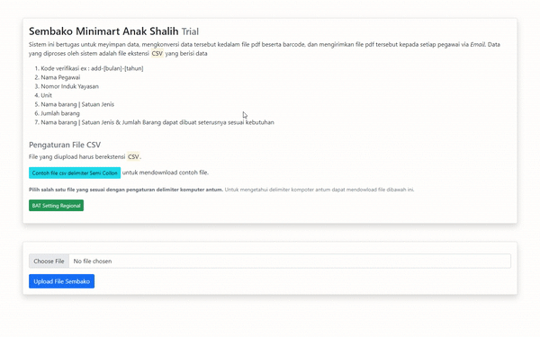
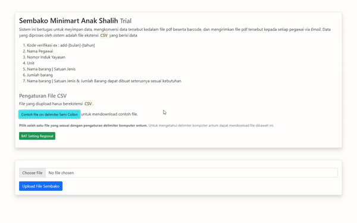
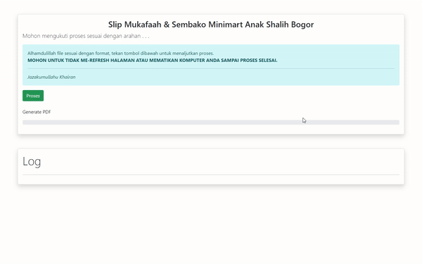
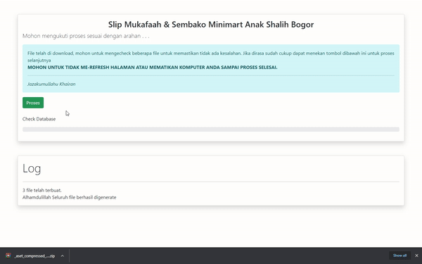
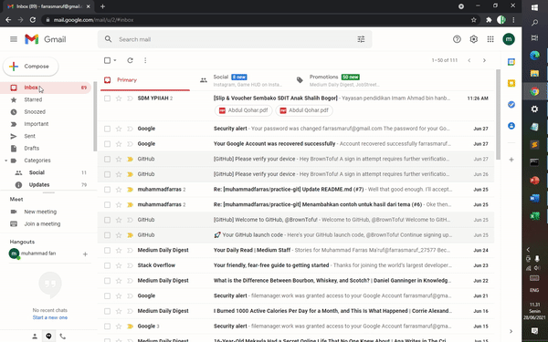

<h1>Sistem Sm&Vs (Slip Mukafaah & Voucher Sembako)</h1>

## Daftar Isi
- [Latar Belakang](#Latar-Belakang)
- [Cara Memasang Sistem di Komputer](#Cara-memasang-Sm&Vs)
- [Fitur Yang Disediakan](#Fitur-dari-Sm&Vs)
- [Cara Penggunaan](#Cara-Menggunakan)
- [Library Yang Digunakan](#Library-yang-digunakan)


## Latar Belakang
Tempat saya berkerja saat ini (YPIIAH) selain memberikan gaji berupa uang juga diberikan kepada setiap pegawai
berupa voucher. Voucher tersebut dapat ditukarkan dengan sembako. Suatu ketika voucher yang saya terima hilang (karena kesalahan saya semdrir)
, akhirnya saya mencoba meminta kembali ke kepala minimart dan diberikan oleh dia.

Namun, dengan diberikan voucher tersebut terlintas dalam pikiran saya, *"Bagaimana jika ada pegawai yang secara sengaja meminta
kembali voucher kepada orang minimart dan diberikan, padahal voucher sebelumnya sudah ia gunakan ?"* Maka orang tersebut
melakukan kecurangan dengan mengambil lebih dari yang diperuntukan olehnya.
___

Maka dari itu, ada baiknya sebuah sistem yang menutup pintu (kecurangan) tersebut dan mampu mempremudah pekerjaan bagian 
kepegawaian serta minimart dalam ;
* Mengubah data mentah kedalam bentuk file **slip dan voucher sembako** dengan ekstension PDF.
* Mendistribusikan **slip dan voucher sembako**.
* Memonitoring pegawai yang sudah mengambil sembako atau yang belum


## Cara memasang Sm&Vs
```
git clone https://github.com/muhammadfarras/slip-mukaffah-dan-voucher-sembako.git
```
Setelah meng- *clone* repositori ini kedalam locak kompter anda :computer:, Anda juga diwajibkan untuk mengimport file basis data (menggunakan MySql) file dapat didownload [disini](media/db.sql)

## Fitur dari Sm&Vs
> Sebagai mana yang telah dijelaskan di **LatarBelakang**, aplikasi ini memliki fitur sebagai berikut
<table>
<tr><th colspan=2>Features</th></tr>
  <tr><td>*Generate*</td><td>Merubah data yang ada didalam file berekstensi CSV kedalam file berbentuk PDF yang berisikan informasi-informasi Slip gaji dan Voucher Sembako</td></tr>
  <tr><td>Menggabungkan File-file</td><td>Data yang di - *generate* akan menghasilkan banyak file Sm&Vs. Jika mendownload satu-satu akan memakan waktu yang sangat lama. Maka dari itu didalam sistem ini secara otomatis file-file akan dikumpulkan dan didownload menjadi satubuah file dengan ekstensi RAR</td></tr>
  <tr><td>Distribusi via Surel :e-mail:</td><td>Sistem secara otomatis mengirim email kepada setiap pegawai. Email tersebut dibaca oleh sistem dari file *CSV* yang diupload pada sistem</td></tr>
  <tr><td>Meyimpan Data</td><td>Data yang diupload kedalam sistem disimpan dan diarsipkan. Degnan data terebut juga dapat digunakan untuk monitoring pengambilan sembako.</td></tr>
</table>

## Cara Menggunakan
<ol>
<li>
  <b>Download format file yang diperlukan</b>

File yang diupload kedalam sistem harus berekstensi *Comma Seperate Value* dengan susunan data yang dapat dibaca oleh sistem.
File tersebut sudah disediakan di halaman awal. Pengguna diwajibkan mendownload file tersebut lalu diisi sesuai dengan data yang ada tanpa merubah susunan setiap kolom isian
  
  
|  |
| ----------------|


</li>

  <li><b>Mengisi file dan mengatur nama dan kode Slip dan Voucher</b>
  
  File tersebut harus diisi sesuai dengan **header** dari setiap kolom. Untuk isian dari kolom **Periode** dan nama file harus sama dan diisi dengan pola ```[add-bulan-tahun]```
  Contoh :
  
  | Periode        | Nama           | NIY	Unit  |	Email	| JK	| Status | Jabatan dan Posisi |dan seterusnya
  | ------------- |:-------------:| -----:|:-------------:| -----:|:-------------:| -----:|:-------------:|
  | add-06-2021 |	Farras Ma'ruf |	123.123 |	SDIT Anak Shalih | a@gmail.com |	L |	Staf Akuntan |	Disesuaikan |
  | add-06-2021 |	Tania Dwi Haryanti |	124.123 |	SDIT Anak Shalih | b@gmail.com |	L |	Tetap	Guru |	Disesuaikan |
  
|  |
| ------- |
  
</li>

<li>
  <b>Upload file yang sudah disetup kedalam sistem</b>
  
  
  
</li>

<li><b>Proses dan Download folder RAR</b>
  
  Jika file yang diupload tidak memunculkan pesan eror atau berhasi :white_check_mark: serta menampilkan pesan

> Alhamdulillah file sesuai dengan format, tekan tombol dibawah ini untuk melanjutkan proses

Maka selanjutnya tekan tombol proses :black_square_button: untuk men - <i>generate</i> data kedalam file PDF dan mengumpulkan serta mendownload file-file PDF kedalam bentuk satu folder RAR.
Folder RAR tersebut berisi kumpulan file <b>Slip Mukafaah dan Voucher Sembako</b> berdasarkan file CSV yang diupload
  

  
</li>

<li><b>Menyimpan Data dan Mendistribusikan Slip Mukafaah dan Voucher Sembako</b>

Setelah folder RAR didownload, langkah selanjutnya tekan kembali tombol proses untuk menyimpan data dan mendistribusikan melalui email berdasarkan daftar email didalam file CSV yang diupload.
  

  
</li>

<li><b>PDF send to target email</b>

Slip Mukafaah dan Voucher Sembako terkirim melalui Email


  
</li>
</ul>

## Library yang digunakan

- [PHPMAILER](https://github.com/PHPMailer/PHPMailer)
- [PHPDOTENV](https://github.com/vlucas/phpdotenv)
- [Bootstrap](https://github.com/twbs/bootstrap)
- [Chart Js](https://github.com/chartjs/Chart.js)
